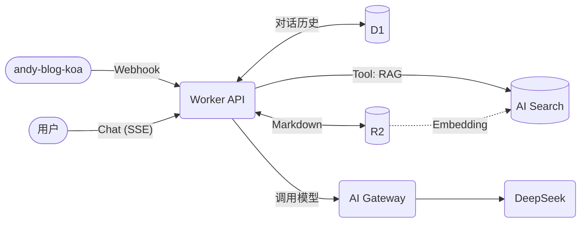

我给博客做了个 AI 助手，它能回答「这个博客的作者写过哪些关于缓存的文章」「介绍一下作者的技术栈」这类问题。整个服务**没有一台自建服务器、没有自管数据库**，全部跑在 Cloudflare 的边缘上。这篇讲它的整体架构。

## 设计原则

三条原则贯穿始终：

- **基础设施原生**：全栈用 Cloudflare 组件（Workers、D1、R2、AI Search、AI Gateway），无自建中间件，把运维复杂度压到最低。
- **工具驱动**：LLM 只当「调度者」，所有真实数据通过工具按需获取，职责边界清晰。
- **知识管道解耦**：知识库的写入（Webhook 同步）与运行时对话完全分离，互不影响，可独立扩展。

## 各组件分工



| 组件 | 角色 |
|---|---|
| **Workers (Hono)** | 面向 Web 的 API 运行时，跑对话与 Webhook 接口 |
| **D1** | SQLite，持久化用户对话历史 |
| **R2** | 存 RAG 知识库的原始 Markdown 文件 |
| **AI Search** | 向量库，提供语义检索（RAG） |
| **AI Gateway** | LLM 请求代理，统一计费/限流/日志 |
| **DeepSeek** | 主力大模型，经 AI Gateway 调用 |

## 两条核心数据流

**写入流（知识库构建）**：博客后端内容一变，就通过带 HMAC 签名的 Webhook 通知 Worker，Worker 验签后把文章转成 Markdown 写进 R2；R2 一变，AI Search 自动增量索引。管理员正常增删改文章，知识库就在后台自动跟上，全程零手工运维。

**读取流（用户对话）**：用户带匿名 token 发起 `POST /chat`，Worker 经过限流、token 校验后，从 R2 读站点/作者信息拼 System Prompt，从 D1 取最近几轮历史，组装好消息后跑 **Agent Loop**：调用模型 → 解析工具调用 → 执行工具（比如查 RAG）→ 带结果再调模型，直到产出最终答案，全程 SSE 流式吐给前端。

## 为什么选边缘 Serverless

对一个个人博客的 AI 助手来说，这套架构的好处非常实在：

- **零运维、按量付费**：没流量就几乎不花钱，不用为一台常驻 GPU/服务器买单；
- **全球低延迟**：Workers 跑在离用户最近的边缘节点；
- **组件即能力**：向量检索、对象存储、SQLite、网关全是托管服务，我只写「胶水」和业务逻辑，不维护任何中间件。

## 目录结构一瞥

```text
src/
├── index.ts        # 入口，路由分发
├── config.ts       # 运行时静态配置
├── webhook/        # 接收 koa 的内容变更，落库到 R2
├── chat-user/      # 用户对话：Agent Loop / 工具 / 签名 / DB 桥接
└── chat-admin/     # 后台：会话查询与管理
```

`webhook/` 和 `chat-user/` 分别对应「写入流」和「读取流」，物理上就是分开的两块，呼应「知识管道解耦」。

## 小结

边缘 Serverless 让个人项目也能拥有一套完整的 RAG + Agent 能力：Workers 跑逻辑、R2 存原文、AI Search 做检索、D1 记历史、AI Gateway 管模型。三条原则——基础设施原生、工具驱动、管道解耦——决定了它好维护、可扩展。后面几篇会拆开讲 Agent Loop、RAG 选型、边缘鉴权这些细节。
