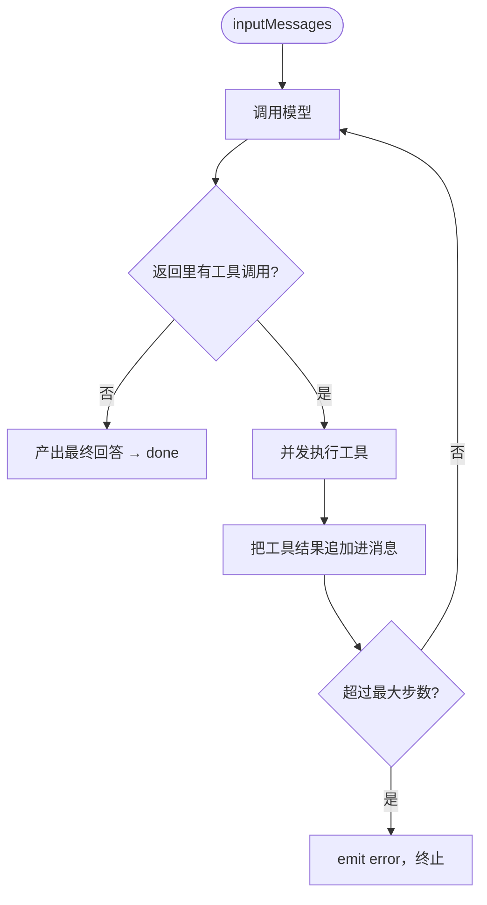

很多人对 AI Agent 的想象是「一个无所不知的模型」。但工程上更稳的范式恰恰相反：**让模型尽量少知道，把真实数据全部交给工具。** 模型只负责「判断该调用哪个工具、怎么综合结果」，也就是当一个调度者。这就是 Tool-driven Agent。

## Agent Loop 的核心循环

一句话概括：**调用模型 → 解析工具调用 → 并发执行工具 → 追加工具结果 → 再次调用模型，循环直到没有工具调用或达到最大步数。**



为什么要循环？因为一个问题可能需要多步：先用 `askKnowledgeBase` 搜到一篇相关文章的 id，再用 `getArticleDetail` 取它的全文，最后综合作答。每一步模型都根据上一步的工具结果决定下一步。

## 工具用 Zod 定义

工具的「描述 + 入参 schema + 执行函数」三件套，用 Zod 定义，再转成 LLM 能理解的 JSON Schema：

```ts
askKnowledgeBase: defineTool({
  description: 'Search the blog knowledge base and return relevant excerpts.',
  inputSchema: z.object({
    query: z.string().describe('A concise search query capturing the user intent.'),
  }),
  execute: async ({ query }) => {
    const { chunks } = await env.AI.aiSearch()
      .get(env.CF_AI_SEARCH_INSTANCE_NAME)
      .search({ messages: [{ role: 'user', content: query }], /* ... */ })
    if (!chunks.length) return 'No relevant content found.'
    return chunks.map((c, i) => ({
      rank: i + 1,
      article_id: c.item.metadata!.id,
      article_title: c.item.metadata!.title,
      excerpt: c.text.slice(0, 600),
    }))
  },
}),
```

`description` 是给模型看的——它靠这句话判断「这个工具能干嘛、什么时候该用」。写好工具描述，几乎是 Agent 调优里性价比最高的事。

## 必须有的护栏：最大步数

工具循环最大的风险是**贪婪死循环**：模型一轮轮地调工具停不下来，token 飞涨、账单爆炸。所以循环必须有硬上限：

```ts
// 配置：每个请求最多几轮工具调用
export const CHAT_AGENT_TOOL_CALL_MAX_STEPS = 5
```

超过就派发 error 事件、强制收尾。这个「代码层硬限制」对某些「推理欲望强」的模型尤其重要——它们倾向于多调几轮工具，不卡上限就会把成本拖垮。

## 流式与异步落库

整个 Loop 跑在一个 SSE 流里，边算边吐：

- 文本增量 → `emit { type: 'text', content }`（前端实时显示）
- 工具开始/结束 → `emit { type: 'tool_start' / 'tool_end' }`（让用户看到「正在检索…」）
- 收尾 → `emit { type: 'done' }`，同时 `waitUntil(saveMessages(...))` 把整轮对话异步写进 D1

`waitUntil` 是 Workers 的利器：响应已经返回给用户了，落库在后台继续，用户不用等数据库写完。

## 工具驱动的好处

1. **职责清晰**：模型管「理解与调度」，工具管「取真实数据」。模型不需要把知识库背进权重里。
2. **可控、可审计**：每次取数都是一次明确的工具调用，有入参有结果，排查问题时一目了然。
3. **易扩展**：想让 Agent 多一种能力，就多定义一个工具，Loop 本身不用改。
4. **降幻觉**：System Prompt 里约束「只用工具结果和已知信息作答，没有就说不知道」，把模型从「自由发挥」拉回「有据可依」。

## 小结

Tool-driven Agent 的精髓是**把模型降级成调度者**：它决定调用哪个工具、如何综合，真实数据全部来自工具。核心是一个「调用-解析-执行-再调用」的循环，配上最大步数护栏防贪婪、SSE 流式提体验、`waitUntil` 异步落库。模型负责聪明，工具负责真实。
