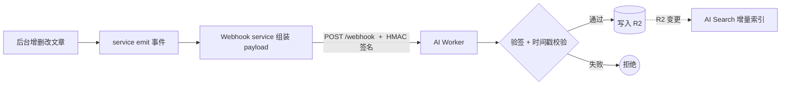

我的博客有个让我挺满意的体验：在后台发一篇文章，几秒钟后 AI 助手就能基于它回答问题了，全程不用手动同步任何东西。这背后是一条自动化的内容同步管道，而它的安全基石是 **HMAC 签名**。

## 管道全貌



CMS 端（NestJS）在文章创建/更新/删除时发出领域事件，Webhook service 监听后组装 payload（`upsert_articles` / `delete_articles`），向 AI 服务 POST。AI 服务验签通过后写 R2，R2 一变 AI Search 自动增量索引。

## 为什么必须签名

`/webhook` 是个公网端点。如果不验证来源，任何人都能伪造请求往你知识库里塞垃圾、或删你的内容。所以发送方和接收方共享一个密钥 `WEBHOOK_SECRET`，用 **HMAC-SHA256** 对请求体签名。

发送方（CMS）：

```ts
const timestamp = Date.now().toString()
const payload = JSON.stringify(body)
const signature = createHmac('sha256', WEBHOOK_SECRET)
  .update(`${timestamp}.${payload}`)
  .digest('hex')

await fetch(endpoint, {
  method: 'POST',
  headers: {
    'Content-Type': 'application/json',
    'X-Webhook-Timestamp': timestamp,
    'X-Webhook-Signature': signature,
  },
  body: payload,
})
```

注意签名覆盖的是 `timestamp.payload`，把时间戳也纳入签名，让它不可被篡改。

## 防重放：把时间戳算进签名

光验签还不够——攻击者可以**截获一个合法请求，反复重放**。所以接收方除了验签，还校验时间戳是否在一个短窗口内（比如 5 分钟）：

```ts
const timestamp = ctx.req.header('X-Webhook-Timestamp')
const signature = ctx.req.header('X-Webhook-Signature')
const body = await ctx.req.text()

// 1. 时间戳必须在 5 分钟内，过期请求直接拒（防重放）
if (Math.abs(Date.now() - Number(timestamp)) > 5 * 60 * 1000) {
  throw new HTTPException(401, { message: 'timestamp expired' })
}

// 2. 用同样的算法重算签名，常量时间比较
const expected = await hmacSha256Hex(SECRET, `${timestamp}.${body}`)
if (!timingSafeEqual(expected, signature)) {
  throw new HTTPException(401, { message: 'bad signature' })
}
```

两道关：签名保证「请求没被篡改、确实来自持密钥的一方」，时间戳窗口保证「就算被截获也没法过几分钟再重放」。

## Fire-and-forget：别让同步拖垮主流程

一个重要的设计：CMS 发 Webhook 是**异步、不阻塞、不强一致**的。文章保存成功就立即返回，同步给 AI 这件事「发了就不管」（fire-and-forget）：

- AI 服务挂了、网络抖动，**绝不能影响文章正常保存**；
- 同步是「锦上添花」，不是「主流程的一部分」；
- 两个 secret 留空时自动禁用同步，本地开发不依赖 AI 服务。

万一某次同步失败，还有「全量重灌」的兜底接口可以手动补，但日常完全自动。

## 小结

「内容一变，知识库自动跟上」靠的是一条 Webhook 管道，而它的安全靠 HMAC-SHA256 + 时间戳防重放：签名防篡改与伪造，时间戳窗口防重放，常量时间比较防时序侧信道。再用 fire-and-forget 把同步和主流程解耦——AI 服务的任何抖动都不该让用户发不出文章。
