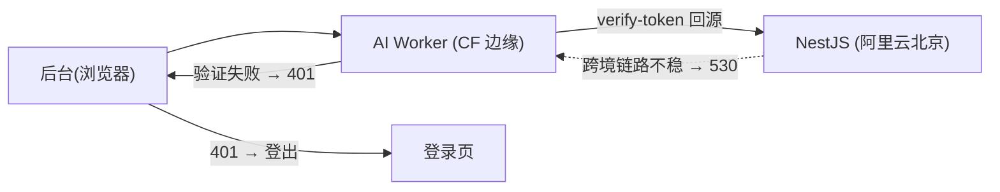

一个真实的线上故障，最后引出一次有意思的架构调整。

## 现象

后台管理面板里，普通操作都正常，但一点「AI 对话管理」这个菜单，立刻被登出，跳回登录页。复现稳定，体验极差。

## 排查

AI 管理模块的数据来自一个独立的 Cloudflare Worker。它的后台接口有鉴权中间件——最初的实现是：**把前端带来的 token 转发回 NestJS 后端的 `/auth/verify-token` 接口验证**，验过了才放行。

抓日志发现，Worker 那个回源验证请求返回了 **HTTP 530**。530 是 Cloudflare 的源站错误。再看链路就懂了：



Worker 在 Cloudflare 全球边缘，后端在阿里云北京。**这条「CF 边缘 → 国内源站」的跨境链路不稳定**，验证请求时不时 530。中间件一看验证没过，返回 401，前端一收到 401 就执行登出逻辑。一个网络抖动，被层层放大成了「点一下就登出」。

## 关键转变：不要修网络，要改架构

第一反应可能是「优化跨境链路」。但跨境网络的稳定性根本不在我掌控之内，靠它就是埋雷。

真正的问题是：**为了验一个 JWT，何必回源？** JWT 本来就是自包含、可离线验证的——只要持有签名密钥，在任何地方都能验，不需要问发证方。

所以解法是：让 Worker 和后端**共享同一个 `JWT_SECRET`**，Worker 在边缘**本地验签**，完全不回源：

```ts
export const authMiddleware = (options: { jwtSecret: string }) =>
  createMiddleware(async (ctx, next) => {
    const authHeader = ctx.req.header('Authorization')
    const token = authHeader?.toLowerCase().startsWith('bearer ')
      ? authHeader.slice(7).trim()
      : null
    if (!token) throw new HTTPException(401, { message: 'Missing token' })

    // 用共享密钥在边缘本地验签，不回源、不跨境
    const payload = await verifyAccessToken(token, options.jwtSecret)
    if (!payload) throw new HTTPException(401, { message: 'Invalid token' })

    await next()
  })
```

`verifyAccessToken` 用 Workers 原生的 `crypto.subtle` 校验 HMAC 签名 + 过期时间，纯本地计算，零网络。

## 收益

- **彻底消除跨境依赖**：鉴权不再有任何回源调用，跨境链路的稳定性与它无关；
- **更快**：本地验签是微秒级，省掉一整个跨洋往返；
- **更稳**：不会再因为源站/网络抖动误判登出；
- **更符合 JWT 的本意**：自包含令牌就该能离线验证，回源验 JWT 本身就是反模式。

代价是两个服务要共享 `JWT_SECRET`，得做好密钥管理（用平台的 secret 机制存、定期轮换）。但这点管理成本，远小于它换来的稳定性。

## 复盘

这次故障的教训不在「530 怎么修」，而在**架构层面消除不可控依赖**。当你发现自己在「优化一条本就不该存在的远程调用」时，先停下来问：这个调用真的必要吗？很多时候，最好的网络优化是「不发这个请求」。

## 小结

「点 AI 就登出」的根因是 Worker 跨境回源验 token 触发 530，被中间件放大成登出。解法不是修网络，而是顺应 JWT「自包含、可离线验证」的本性——共享密钥、边缘本地验签、彻底不回源。消除不可控的远程依赖，往往比优化它更有效。
