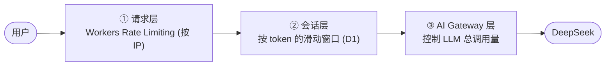

把 AI 对话开放给匿名访客，最现实的恐惧是：**账单**。每一次对话背后都是真金白银的 LLM 调用，一旦被恶意刷量，几小时就能烧掉一笔不小的费用。所以限流不是可选项，是必需品。我用了三层互补的限流。



## 第一层：请求层（按 IP 防刷）

最外层用 Cloudflare 的 Workers Rate Limiting，按 IP 做滑动窗口限流。它挡的是**最粗暴的攻击**——有人写脚本疯狂打你的接口。配置就在 `wrangler.jsonc` 的 `ratelimits` 字段，由平台在边缘执行，请求还没进到你的业务逻辑就被拦下，成本最低。

## 第二层：会话层（按 token 防滥用）

第一层防不住「拿到合法匿名 token 后慢慢刷」的人。所以第二层按**会话**限流：每个会话 token 在一个时间窗口内，最多发多少条消息、消耗多少 LLM token。

```ts
export const CHAT_AGENT_RATE_LIMIT_ROLLING_WINDOW_HOURS = 6
export const CHAT_AGENT_RATE_LIMIT_MAX_MESSAGES = 36
export const CHAT_AGENT_RATE_LIMIT_MAX_TOKENS = 60000
```

实现上借助 D1：每轮对话都把消息数和 token 用量记下来，新请求进来时统计窗口内的累计值，超了就拒。效果类似 ChatGPT 高级模型那种「你这几小时用得太多了，歇会儿」的用量上限——既不一刀切封死，又防住了单用户的过度消耗。

## 第三层：AI Gateway（兜底花费）

前两层都是「防特定坏人」，第三层是**给总花费上保险**。Cloudflare AI Gateway 在「Workers → LLM」之间做限流，它管的不是某个用户，而是**整体调用量的天花板**。

它的意义是：哪怕前两层因为某种原因被绕过、或者我自己代码写出 bug 导致循环调用，AI Gateway 这道闸也能把总调用量摁在一个范围内，避免账单意外暴涨。

怎么估这个值？给个经验公式：

> 假设同时在线 5 人 / 每人每小时 20 条消息 / 每条消息平均 2 次 LLM 调用（含工具调用），峰值 = 5 × 20 × 2 = 200 次/小时，设成 150–300/小时比较合适。

## 为什么要三层

单独任何一层都有缝：

| 层 | 防住什么 | 防不住什么 |
|---|---|---|
| ① 请求层(IP) | 无 token 的暴力刷 | 换 IP、合法 token 慢刷 |
| ② 会话层(token) | 单会话过度使用 | 大量伪造会话 |
| ③ Gateway | 总花费失控（兜底） | —— |

三层叠起来，从「单点防御」变成「纵深防御」：外层拦广撒网的攻击、中层管单用户的滥用、内层给整体花费封顶。任何一层漏了，还有下一层兜着。

## 一点心得

- **限流要分层，且每层目标不同**：别指望一个限流器解决所有问题。
- **最贵的资源要有「总量闸」**：LLM 调用直接对应花费，必须有一个与「具体是谁」无关的全局上限兜底。
- **限流值要可配置**：窗口、条数、token 上限都抽成配置常量，方便按实际流量调整，而不是写死在逻辑里。

## 小结

公开 AI 接口的限流是「省钱」的工程。三层防护各司其职：请求层按 IP 防暴力刷、会话层按 token 防单用户滥用、AI Gateway 给整体 LLM 花费兜底封顶。纵深防御，层层兜底，才能安心把 AI 助手开放给所有访客。
