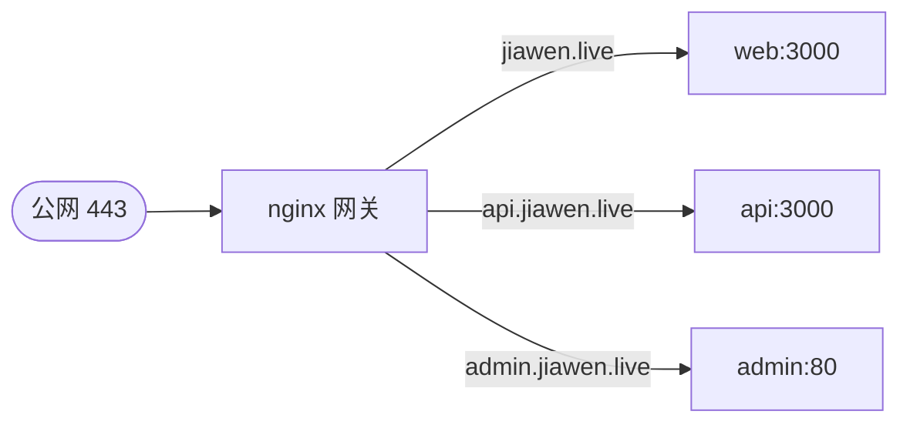

我的博客所有服务跑在一台机器上：前台、后台、API 各是一个容器。它们怎么共用 80/443、按域名各回各家？答案是一个 nginx 网关，作为整个系统的唯一入口。

## 一个入口，按域名分发

业务容器不直接对外暴露端口，全部流量经 nginx 网关进出。网关按 `server_name` 把不同域名路由到对应容器（容器间用服务名通信）：



这样做的好处：TLS 在一处统一收口、业务容器不暴露端口更安全、加子域只需加一段 server 配置。

## 域名用 envsubst 注入，不写死

域名不该硬编码进配置文件——换域名、给别人自部署都得改源码。nginx 官方镜像支持启动时对 `templates/*.template` 执行 `envsubst`，把环境变量渲染进配置：

```yaml
gateway:
  image: nginx:1.27-alpine
  environment:
    BLOG_DOMAIN: ${BLOG_DOMAIN}
    API_DOMAIN: ${API_DOMAIN}
    ADMIN_DOMAIN: ${ADMIN_DOMAIN}
    # 只替换名字含 DOMAIN 的变量，保护 $host / $scheme 等 nginx 内置变量
    NGINX_ENVSUBST_FILTER: "DOMAIN"
  volumes:
    - ./nginx/templates:/etc/nginx/templates:ro
    - ./nginx/snippets:/etc/nginx/snippets:ro
    - ./nginx/certs:/etc/nginx/certs:ro
```

那个 `NGINX_ENVSUBST_FILTER: "DOMAIN"` 是个关键细节：`envsubst` 默认会替换**所有** `$xxx`，连 nginx 自己的 `$host`、`$scheme` 都会被误伤替换成空。用 filter 限定「只替换名字含 DOMAIN 的变量」，保护内置变量。

## HTTP/3 的端口要点

开 HTTP/3（QUIC）需要 nginx ≥ 1.25，而且——这点很容易漏——**要同时暴露 UDP 443**，因为 QUIC 跑在 UDP 上：

```yaml
ports:
  - "80:80"
  - "443:443/tcp"
  - "443:443/udp"   # HTTP/3 (QUIC) 必须，少了它 h3 协商不上
```

少了那行 `udp`，浏览器会悄悄回退到 HTTP/2，你还以为 h3 生效了。

## 证书热加载：每 6 小时 reload

证书由 acme 服务自动续期（DNS-01 泛域名）。续期后证书文件变了，nginx 需要 reload 才会加载新证书。我让网关每 6 小时平滑 reload 一次，通过挂一个 `docker-entrypoint.d/` 钩子脚本实现：

```yaml
volumes:
  # 周期性 reload：证书续期后自动生效（经 entrypoint.d 执行，
  # 不覆盖 command，否则官方 entrypoint 会跳过模板渲染）
  - ./nginx/entrypoint.d/90-periodic-reload.sh:/docker-entrypoint.d/90-periodic-reload.sh:ro
```

这里有个坑要避：**不要用 `command` 覆盖容器启动命令去跑 reload 循环**，否则会绕过官方 entrypoint 的模板渲染步骤，导致 `envsubst` 没执行、配置里全是没替换的占位符。正确做法是把脚本放进 `docker-entrypoint.d/`，让它作为官方启动流程的一环被执行。

`nginx -s reload` 是平滑的——旧连接照常处理完，新连接用新配置，不中断服务。

## 小结

单机多服务的统一入口用一个 nginx 网关：按域名 `server_name` 分发、TLS 一处收口、业务容器不暴露端口。域名用 `envsubst` 注入并用 filter 保护内置变量；HTTP/3 记得同时开 UDP 443；证书续期靠周期性平滑 reload 生效，且 reload 脚本要走 `docker-entrypoint.d` 而非覆盖 command。
