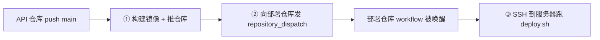

我的博客是多仓库结构：每个服务（前台、后台、API、AI）一个代码仓库，再加一个**部署仓库**统一管 compose、nginx、证书。问题随之而来：API 仓库 push 之后，怎么自动触发部署仓库去更新生产？

答案是 GitHub 的 **`repository_dispatch`**——一个跨仓库事件桥接机制。

## 跨仓库事件桥接

流程是两段式的：



**第一段**在服务代码仓库：push 到 main → 构建 Docker 镜像并打 tag、推到镜像仓库 → 用 `peter-evans/repository-dispatch` 向部署仓库发一个自定义事件，把镜像 tag 作为 payload 带过去：

```yaml
- name: Notify deploy repo
  uses: peter-evans/repository-dispatch@v3
  with:
    token: ${{ secrets.DEPLOY_DISPATCH_TOKEN }}
    repository: zzlw/andy-blog-deploy
    event-type: deploy-api
    client-payload: '{"image_tag": "${{ github.sha }}"}'
```

**第二段**在部署仓库：监听这个事件，SSH 到生产服务器执行部署脚本，把要部署的镜像 tag 传进去：

```yaml
on:
  repository_dispatch:
    types: [deploy-api]

jobs:
  deploy:
    runs-on: ubuntu-latest
    steps:
      - uses: appleboy/ssh-action@v1
        with:
          host: ${{ secrets.SSH_HOST }}
          username: ${{ secrets.SSH_USER }}
          key: ${{ secrets.SSH_KEY }}
          script: |
            cd /opt/andy-blog-deploy
            ./scripts/deploy.sh api ${{ github.event.client_payload.image_tag }}
```

## 为什么不把部署逻辑塞进每个服务仓库

也可以让每个服务仓库自己 SSH 上去部署。但那样的话，**生产服务器的 SSH 密钥要分发给每一个服务仓库**，攻击面成倍扩大；部署逻辑也会在各仓库间复制。

集中到部署仓库后：SSH 密钥只存一处、部署脚本只有一份、所有部署都从一个仓库的 Actions 里可见可审计。服务仓库只需要一个「能发 dispatch 事件」的低权限 token，拿不到生产服务器。**职责分离 + 最小权限。**

## 一键回滚：按 tag 部署的福利

部署脚本接收的是**镜像 tag**而不是「构建最新代码」，这带来一个巨大好处——**回滚就是部署一个旧 tag**：

```bash
# 生产出问题，回滚到上一个已知正常的 commit
ssh deploy@server './scripts/deploy.sh api <上一个正常的 sha>'
```

因为每次构建的镜像都按 commit sha 打了 tag、留在镜像仓库里，回滚不需要 revert 代码、不需要重新构建，**直接拉旧镜像重启，秒级完成**。这正是前面「一次构建、多处运行 / 不可变镜像」原则的红利兑现。

## 几个实践要点

- **token 最小权限**：dispatch token 只给「触发 workflow」的权限，绝不给它接触生产的能力。
- **payload 传 tag 不传分支**：传具体 commit sha，保证「构建的、推送的、部署的」是同一个产物，杜绝竞态。
- **部署脚本幂等**：同一个 tag 部署多次结果一致，重试安全。

## 小结

多仓库架构下，用 `repository_dispatch` 把「服务仓库构建完成」桥接到「部署仓库执行部署」，既解耦又安全——SSH 密钥和部署逻辑集中一处，服务仓库只持低权限 token。再用「按镜像 tag 部署」让回滚退化成「部署一个旧 tag」，秒级、无需重新构建。
