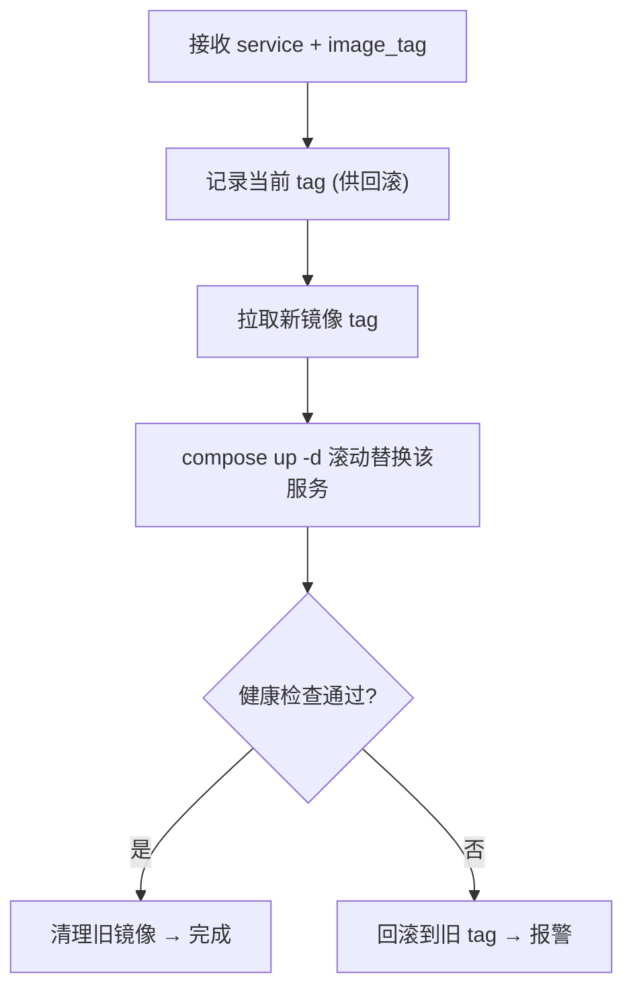

很多人的「部署脚本」就是一句 `docker compose up -d`。它能跑，但有两个隐患：更新瞬间可能有停机、新版本起不来时没人兜底。我的 `deploy.sh` 围绕「**零停机 + 失败自愈**」多做了几步。

## 部署脚本要做的事



核心逻辑大致是：

```bash
#!/usr/bin/env bash
set -euo pipefail

SERVICE="$1"          # 要部署的服务，如 api
NEW_TAG="$2"          # 目标镜像 tag（commit sha）

# 1. 记下当前 tag，失败时好回滚
OLD_TAG="$(current_running_tag "$SERVICE")"

# 2. 拉新镜像（失败就停，不动现有服务）
export IMAGE_TAG="$NEW_TAG"
docker compose -f docker-compose.yml -f docker-compose.prod.yml pull "$SERVICE"

# 3. 滚动替换：只重建目标服务，依赖不动
docker compose -f docker-compose.yml -f docker-compose.prod.yml up -d \
  --no-deps "$SERVICE"

# 4. 健康检查
if ! wait_healthy "$SERVICE" 60; then
  echo "健康检查失败，回滚到 $OLD_TAG"
  IMAGE_TAG="$OLD_TAG" docker compose ... up -d --no-deps "$SERVICE"
  exit 1
fi

# 5. 成功，清理悬空镜像
docker image prune -f
```

## 关键动作拆解

**① 先拉镜像，再替换。** `pull` 单独一步且失败即停。这样网络问题/镜像不存在时，**现有服务原封不动**，不会出现「拉到一半把旧的停了、新的又起不来」的中间态。

**② `--no-deps` 只动目标服务。** 部署 API 时不该顺手重启 MongoDB、Redis。`--no-deps` 限定只重建指定服务，避免无谓地动数据库这类有状态依赖。配合容器自身的滚动替换，新容器健康后旧容器才退出，请求几乎无感切换。

**③ 健康检查是零停机的灵魂。** 「容器起来了」不等于「服务能用了」——进程在跑但还没连上数据库、还没加载完，照样 502。所以要轮询服务的健康端点，**真正 ready 了才算部署成功**：

```bash
wait_healthy() {
  local svc="$1" timeout="$2" elapsed=0
  until curl -fsS "http://localhost:3000/health" >/dev/null 2>&1; do
    sleep 3; elapsed=$((elapsed + 3))
    [ "$elapsed" -ge "$timeout" ] && return 1
  done
}
```

**④ 失败自动回滚。** 健康检查没过，立刻用记录的 `OLD_TAG` 把服务拉回旧版本。因为旧镜像还在本地，回滚是秒级的。**部署可以失败，但不能让站点挂着没人管。**

**⑤ `set -euo pipefail` 打底。** 任何一步出错立即终止、未定义变量报错、管道中任意环节失败都算失败。部署脚本最怕「错了还继续往下跑」，这一行是底线。

## 为什么值得多写这几十行

- **更新无感**：用户在你部署时刷新页面，不会撞上 502；
- **坏版本进不了生产**：起不来的版本被健康检查挡下并自动回滚，不会「发布完才发现挂了」；
- **可重复、可信任**：每次部署走同样的流程，CI 调它、手动也能调它，行为一致。

## 小结

零停机部署的脚本要点：先 `pull` 后替换（保护现有服务）、`--no-deps` 只动目标、健康检查确认真正 ready、失败自动回滚到旧 tag、`set -euo pipefail` 兜底。多写这几十行，换来的是「敢在白天部署」的底气。
