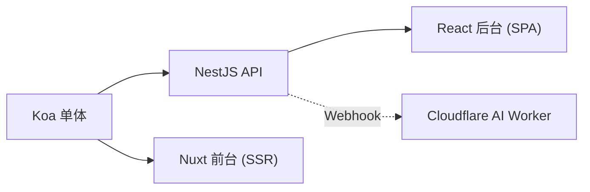

我的博客现在是四个服务：NestJS API、Nuxt SSR 前台、React SPA 后台、Cloudflare 边缘 AI。但它的起点只是一个 Koa 单体。这篇复盘这条演进路线——关键不是「拆成了几个服务」，而是**每一步拆分背后的具体动因**。

## 起点：Koa 单体

最早就一个 Koa 应用：渲染页面、提供接口、连数据库，全在一个进程里。对一个刚起步的博客，这完全正确——**单体是默认选项，简单、好部署、改起来快**。不要一上来就上微服务，那是给自己找罪受。

单体跑了很久。直到几个具体痛点逐一出现，才推着它一步步拆开。

## 第一拆：前后端分离（API 独立）

**痛点**：想做一个独立的内容管理后台，还想让前端能换框架、能做 SSR。模板渲染和业务逻辑耦在一起，动弹不得。

**动作**：把后端收敛成纯 **RESTful API**（后来用 NestJS 重写），前端独立出去。从此后端只管数据、不管渲染，前端爱用什么技术、怎么渲染都行。

**收益**：前后端可独立开发、独立部署；API 同时服务前台和后台两个消费者。

## 第二拆：前台 SSR 与后台 SPA 分家

**痛点**：前台要 SEO、要首屏速度，得 SSR；后台是给自己用的管理工具，要的是交互效率，纯 SPA 足矣。两者的技术诉求完全相反。

**动作**：前台用 **Nuxt（SSR）**，后台用 **React + Ant Design（SPA）**。各自挑最合适的栈。

**收益**：前台 SEO 友好、首屏快；后台开发体验好、组件现成。一个面向访客，一个面向作者，互不掣肘。

## 第三拆：AI 能力放到边缘

**痛点**：想加一个 RAG + Agent 的 AI 助手。它的运行特征和主站完全不同——按量付费、需要靠近用户、依赖一堆托管 AI 组件。塞进主站后端既不合算也不优雅。

**动作**：AI 服务独立成一个 **Cloudflare Worker**，跑在边缘，用 D1/R2/AI Search/AI Gateway。主站通过带签名的 Webhook 跟它单向同步内容。

**收益**：AI 服务零运维、按量付费、全球低延迟；它挂了也完全不影响主站读写（fire-and-forget 同步）。

## 演进图

## 复盘：好的演进有什么共性

1. **每次拆分都由具体痛点驱动**，不是「听说微服务好」。没有痛点就不拆——单体能扛的时候，单体最香。
2. **沿着「变化方向不同」的缝切**：前台/后台诉求相反、AI/主站运行特征迥异，这些「天然的裂缝」就是好的拆分边界。
3. **拆分要让依赖变弱而非变强**：四个服务之间是 REST 调用 + 单向 Webhook，没有谁强耦合谁，一个挂了其他能活。
4. **保持可回退的简单内核**：API 始终是单一事实来源，其余都是它的消费者；这让架构再怎么长，核心依然清晰。

## 小结

从单体到四服务，不是一次「设计」出来的，而是被一个个真实痛点**推**出来的渐进过程：先分前后端、再分前台后台、最后把 AI 推到边缘。每一步都有明确动因，每条缝都切在「变化方向不同」的地方。架构演进的智慧，一半在「何时拆」，另一半在「忍住不过早拆」。
